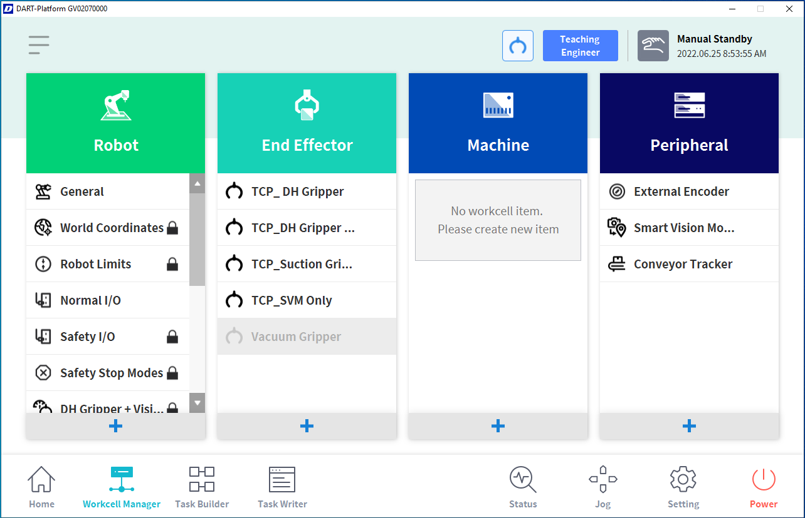
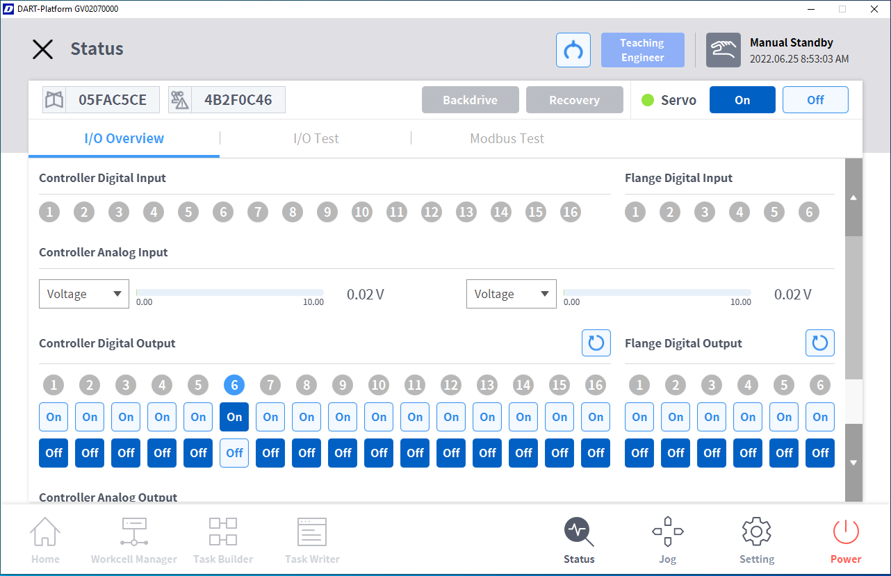
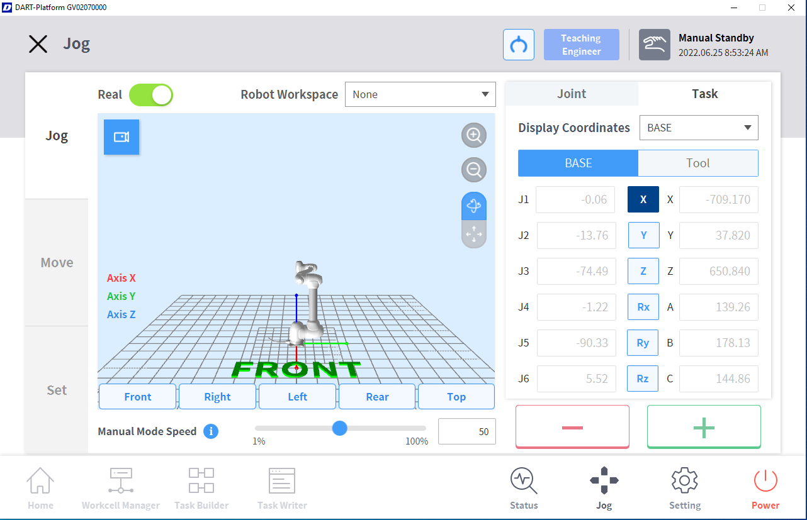
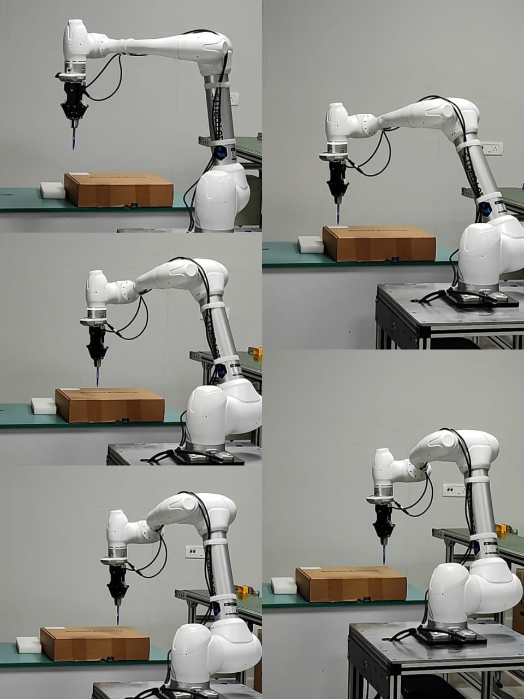

# Lab-Ex.-No---7-Execute-a-program-for-Straight-line-and-Circular-interpolation-in-Doosan-Industrial-cobot
## Aim : 
To Execute a program for Straight-line and Circular interpolation in Doosan Industrial Cobot using DRL studio.

## Components Required:

*Doosan Industrial Collaborative Robot

*DRL (Doosan Robotics Language) Studio Software

## Theory 
INTERPOLATION

Interpolation, which is necessary for any type of programming, consists of generating data points between given coordinate axis positions. Within the Machine Control Unit (MCU), a device called an interpolator causes the drives to move simultaneously from the start to the end of the command. The interpolator is either an electronic hardware device for a NC system, or a software program for a CNC system. An interpolator provides two functions:

It calculates individual axis velocities to drive the tool along the programmed path at the given feed rate.

It generates thousands of intermediate coordinate points along the programmed path between the start point and the end point of the cut.

During positioning, all programmed axes move simultaneously at the specified feed rates until each axis has reached its destination. All drives start together, but without an interpolator individual destinations are reached successively according to the path traveled. However, an interpolator coordinates these axis motions in such a way that the programmed path is constantly maintained from the beginning to the end of the movement.

Linear and circular interpolation are most commonly used in CNC programming applications:

Linear interpolation is used for straight-line machining between two points.

Circular interpolation is used for circles and arcs.

Helical interpolation, used for threads and helical forms, is available on many CNC machines.

Parabolic and cubic interpolation are used by industries that manufacture parts having complex shape such as aerospace parts, and...

## Procedure:

Manipulate the end effector as per the given configuration. Movement Should Initiate in P1 and progress till the end point. Travel path should be in sequence as stated below.

Linear Interpolation

Circular Interpolation

## PROGRAM

### Linear Interpolation

### Circular Interpolation

## OUTPUT
### Linear Interpolation

### Circular Interpolation

## Result
A program for Straight-line and Circular interpolation in Doosan Industrial Cobot using DRL studio has been executed successfully..

 
